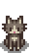

To make the icon theme active in VS Code, you need to:

  1. First, package the extension:
  vsce package

  2. Then install it:
  code --install-extension stardew-valley-icon-theme-*.vsix
  
  <h1 align="center">
    
     
    Stardew Valley Icon Theme
</h1>

🐈 Get the Stardew Valley Icon Theme into VS Code! 🐈‍⬛

 A Stardew Valley inspired icon theme, based on the amazing game created by <a href="https://stardewvalleywiki.com/ConcernedApe"> ConcernedApe </a>.

## Support

**Still Very Early In Development! Current icon support is centered around Web Development.**

## Icons Overview

## Resources

Icon Resources obtained from: [https://stardewvalleywiki.com/Stardew_Valley_Wiki](https://stardewvalleywiki.com/Stardew_Valley_Wiki)